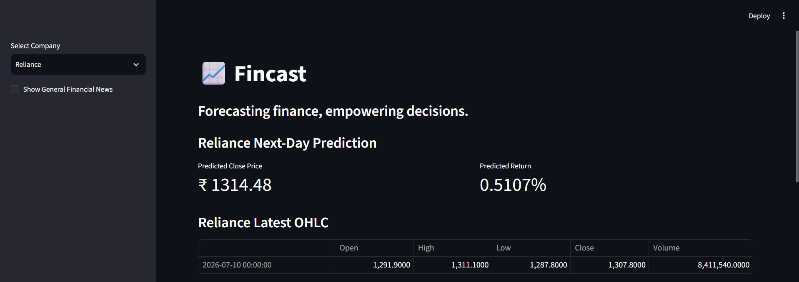
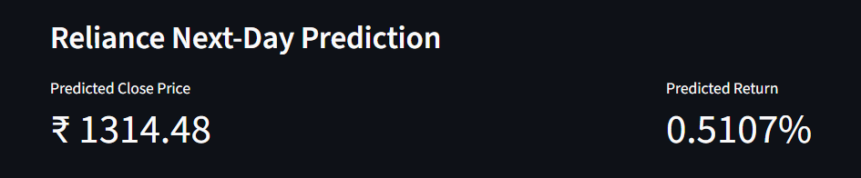
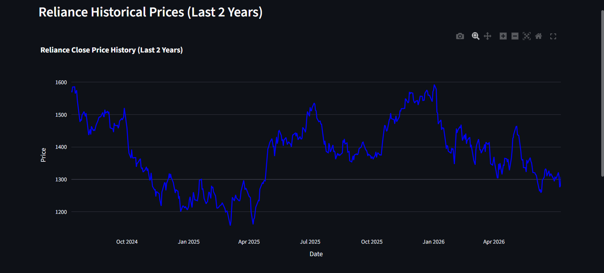
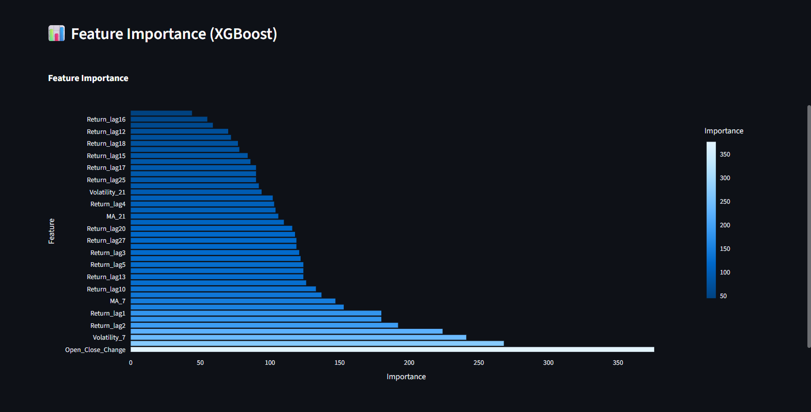

# Fincast

> AI-powered stock price prediction system using XGBoost, feature engineering, and Streamlit for interactive financial analysis.



## Overview

Fincast is a machine learning-based stock market prediction system that analyzes historical stock data, engineers meaningful financial features, and predicts the next trading day's stock return using the XGBoost algorithm.

The application provides an interactive Streamlit dashboard where users can explore multiple Indian stocks, visualize historical price trends, view model predictions, analyze feature importance, and stay updated with financial news.

Developed as part of an Artificial Intelligence academic project, Fincast demonstrates the practical application of machine learning, time-series analysis, and financial data visualization.

---

## Features

- Predicts next-day stock returns using XGBoost
- Interactive Streamlit dashboard
- Historical stock price visualization
- Feature engineering using financial indicators
- Walk-forward validation for realistic time-series evaluation
- Feature importance visualization
- Financial news integration
- Multiple Indian stock support
- Automated data updates using Yahoo Finance

---

## Technology Stack

### Programming Language

- Python

### Machine Learning

- XGBoost
- Scikit-learn
- NumPy
- Pandas

### Data Source

- Yahoo Finance (yfinance)

### Data Visualization

- Plotly
- Matplotlib

### Web Framework

- Streamlit

### Model Persistence

- Joblib

---

## Project Workflow

```
Historical Stock Data
          │
          ▼
Data Preprocessing
          │
          ▼
Feature Engineering
          │
          ▼
XGBoost Model
          │
          ▼
Next-Day Prediction
          │
          ▼
Interactive Streamlit Dashboard
```

---

## Screenshots

### Dashboard


### Prediction



### Historical Price Analysis



### Feature Importance



### Financial News


---

## Machine Learning Pipeline

The prediction pipeline includes:

- Historical data collection from Yahoo Finance
- Data preprocessing and cleaning
- Feature engineering
  - Moving averages
  - Volatility indicators
  - Daily returns
  - High-Low spread
  - Lag features
- XGBoost regression model
- Walk-forward validation
- Interactive visualization of predictions and insights

---

## Future Enhancements

- Support additional global stock exchanges
- Deep learning-based time-series forecasting
- Portfolio optimization
- Risk analysis dashboard
- Sentiment analysis using financial news
- Explainable AI using SHAP values
- Cloud deployment with scalable infrastructure

---

## Team

Developed as a collaborative Artificial Intelligence project at **Thapar Institute of Engineering & Technology**.

### Team Contributions

- **Gunpreet Singh**
  - Research
  - Data modelling
  - Documentation

- **Mantra Gupta**
  - Data preprocessing
  - XGBoost model development

- **Ayush Kumar**
  - Reinforcement learning integration
  - Streamlit deployment

---

## Disclaimer

This project is intended for educational and research purposes only.

Stock market predictions generated by this application should not be considered financial or investment advice.

---

## Acknowledgements

- Yahoo Finance
- Streamlit
- Scikit-learn
- XGBoost
- Plotly
- Thapar Institute of Engineering & Technology
